# Diffusion Models: From First Principles to Latent Diffusion (Stable Diffusion)

A comprehensive, self-contained educational curriculum on **Denoising Diffusion Probabilistic Models (DDPM)**. This project guides you step-by-step from intuitive 2D point manifolds to Convolutional U-Nets, Classifier-Free Guidance (CFG), Fast DDIM Sampling, and Latent Diffusion Models (LDM).

---

## 🗺️ Curriculum Architecture Progression

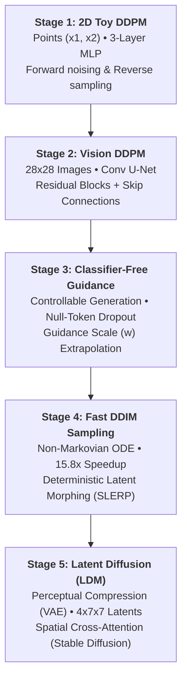

---

## 📚 Curriculum Summary Table

| Stage | Module Directory | Data Domain | Network Architecture | Key Takeaways | Status |
|---|---|---|---|---|---|
| **01** | [`01_toy_2d_diffusion`](./01_toy_2d_diffusion) | 2D Points $(x_1, x_2)$ | 3-Layer MLP + Time Embeddings | Closed-form $q(x_t\|x_0)$, $\epsilon$-prediction, Reverse trajectory | ✅ Complete |
| **02** | [`02_mnist_ddpm`](./02_mnist_ddpm) | 28×28 Grayscale Images | Convolutional U-Net (~1.2M params) | Spatial down/up-sampling, Residual blocks, Skip connections | ✅ Complete |
| **03** | [`03_conditional_cfg`](./03_conditional_cfg) | Class-Conditioned Digits | Conditional U-Net + Label Embedding | Classifier-Free Guidance (CFG), Null token dropout, Guidance scale $w$ | ✅ Complete |
| **04** | [`04_fast_sampling_ddim`](./04_fast_sampling_ddim) | Accelerated Sampling | Non-Markovian Sampler | **15.8× speedup** (20 steps vs 300), Deterministic ODE ($\eta=0$), SLERP | ✅ Complete |
| **05** | [`05_latent_diffusion`](./05_latent_diffusion) | Latent Space ($4\times 7\times 7$) | VAE + Cross-Attention Latent U-Net | Perceptual compression, Two-stage pipeline, Stable Diffusion architecture | ✅ Complete |

---

## 🧠 Core Mathematical Foundation

Diffusion models learn to reverse a gradual noising process:

1. **Forward Noising ($q$)**: Adding Gaussian noise over $T$ timesteps with variance schedule $\beta_1, \dots, \beta_T$:
   $$q(x_t | x_{t-1}) = \mathcal{N}\left(x_t; \sqrt{1 - \beta_t} x_{t-1}, \beta_t \mathbf{I}\right)$$
   Reparameterization shortcut to jump directly to any timestep $t$:
   $$x_t = \sqrt{\bar{\alpha}_t} x_0 + \sqrt{1 - \bar{\alpha}_t} \epsilon, \quad \epsilon \sim \mathcal{N}(0, \mathbf{I})$$
   where $\alpha_t = 1 - \beta_t$ and $\bar{\alpha}_t = \prod_{s=1}^t \alpha_s$.

2. **Denoising Network ($\epsilon_\theta$)**: An artificial neural network trained with MSE loss to predict added noise:
   $$\mathcal{L}_{\text{simple}}(\theta) = \mathbb{E}_{t, x_0, \epsilon} \left[ \| \epsilon - \epsilon_\theta(x_t, t) \|^2 \right]$$

3. **Reverse Sampling ($p_\theta$)**: Starting from pure Gaussian noise $x_T \sim \mathcal{N}(0, \mathbf{I})$ and stepping backwards:
   $$x_{t-1} = \frac{1}{\sqrt{\alpha_t}} \left( x_t - \frac{\beta_t}{\sqrt{1 - \bar{\alpha}_t}} \epsilon_\theta(x_t, t) \right) + \sigma_t z, \quad z \sim \mathcal{N}(0, \mathbf{I})$$

---

## 🔬 Stage-by-Stage Results & Visual Walkthrough

### Stage 1: 2D Toy Distribution Diffusion
- **Directory**: [`01_toy_2d_diffusion/`](./01_toy_2d_diffusion)
- **Goal**: Demystify the mathematics by plotting every coordinate point $(x_1, x_2)$ directly.

#### Forward Noising ($q$)
Starting from clean Swiss Roll coordinates, points gradually disperse into isotropic Gaussian noise:
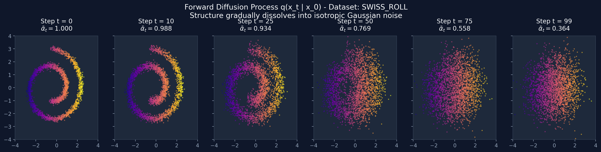

#### Reverse Denoising ($p_\theta$)
Starting from pure random noise $x_T \sim \mathcal{N}(0, \mathbf{I})$, the trained MLP denoises points back into a crisp spiral:
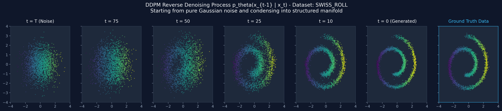

#### Final Comparison
Ground truth distribution vs. 2,500 samples generated by the diffusion model:
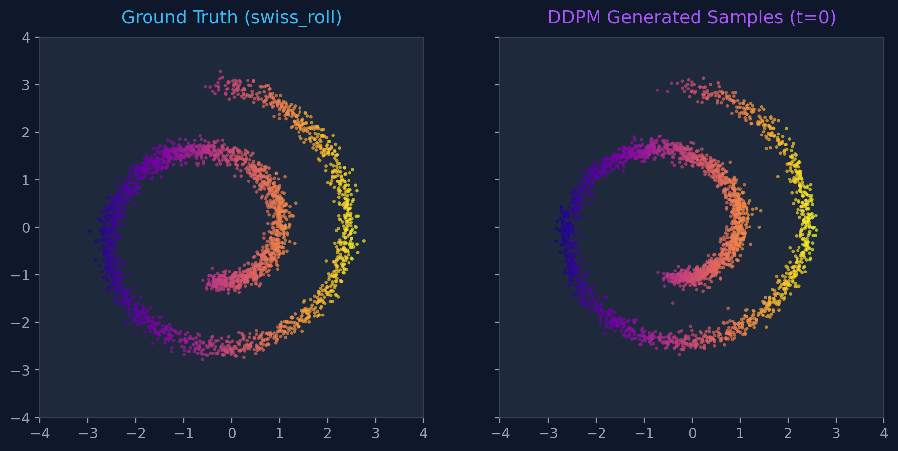

```powershell
# Commands to run Stage 1
cd 01_toy_2d_diffusion
..\.venv\Scripts\python.exe inspect_forward.py --dataset swiss_roll
..\.venv\Scripts\python.exe train.py --dataset swiss_roll --epochs 35
..\.venv\Scripts\python.exe sample.py --checkpoint checkpoints/toy_ddpm_swiss_roll.pt
```

---

### Stage 2: Vision DDPM on 28×28 Images (MNIST)
- **Directory**: [`02_mnist_ddpm/`](./02_mnist_ddpm)
- **Goal**: Transition from coordinate vectors to 2D image grids using a Convolutional U-Net with skip connections.

#### Forward Image Corruption
Real handwritten digits dissolve into static noise over $T=300$ steps:
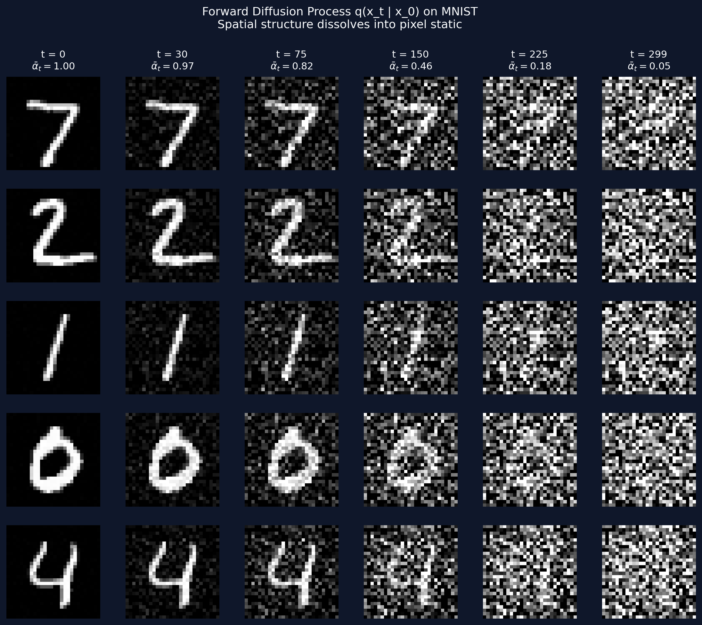

#### Reverse Trajectory Strip
Handwritten strokes crystallizing out of pure pixel noise:
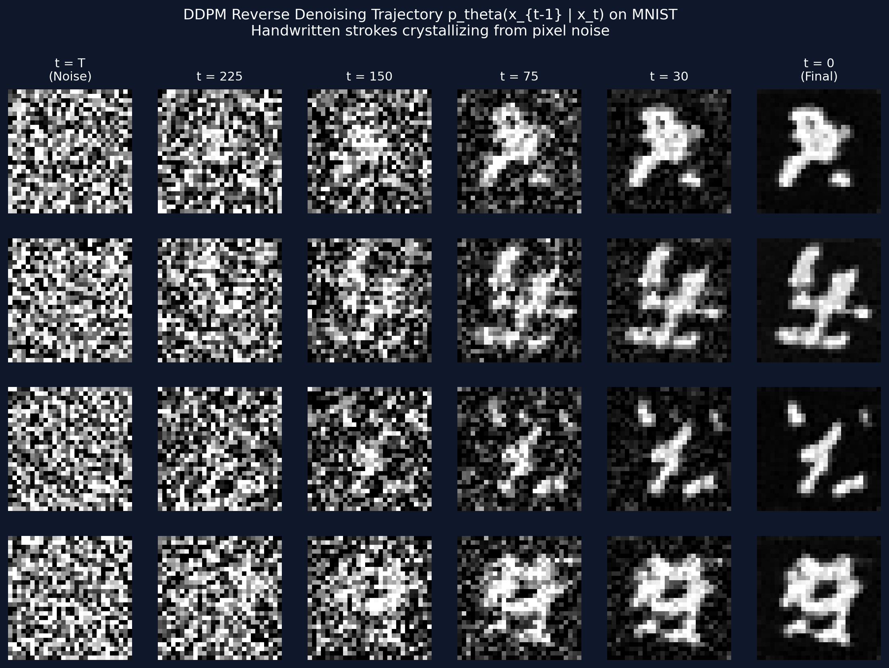

#### Synthesized Digits Showcase
32 novel digits generated unconditionally from pure noise:
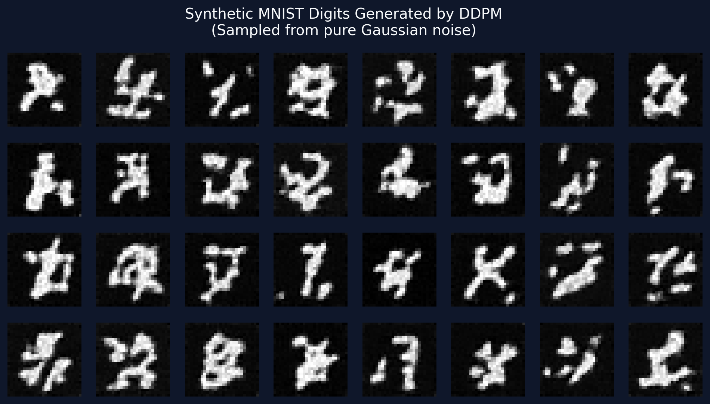

```powershell
# Commands to run Stage 2
cd 02_mnist_ddpm
..\.venv\Scripts\python.exe inspect_forward.py --dataset mnist
..\.venv\Scripts\python.exe train.py --dataset mnist --epochs 6 --max_samples 6400
..\.venv\Scripts\python.exe sample.py --checkpoint checkpoints/mnist_ddpm_mnist.pt --samples 32
```

---

### Stage 3: Conditional Diffusion & Classifier-Free Guidance (CFG)
- **Directory**: [`03_conditional_cfg/`](./03_conditional_cfg)
- **Goal**: Command the model to generate specific classes on demand using label dropout ($p=0.15$) and gradient extrapolation:
  $$\tilde{\epsilon}_\theta = \epsilon_\theta(x_t, t, \varnothing) + w \cdot \Big(\epsilon_\theta(x_t, t, y) - \epsilon_\theta(x_t, t, \varnothing)\Big)$$

#### Controllable 0–9 Digit Matrix
Every row is explicitly commanded to produce target digits 0 through 9 ($w=3.0$):
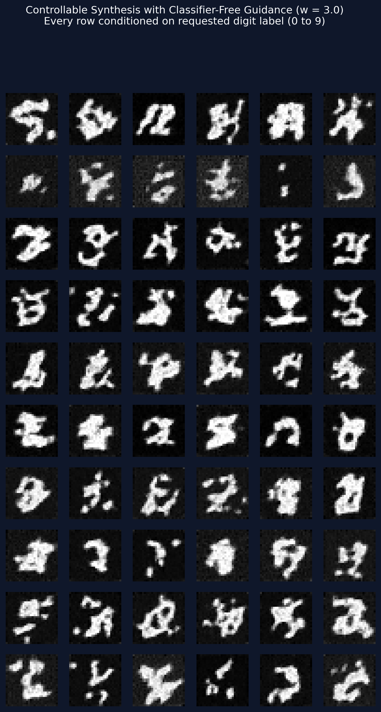

#### Guidance Scale ($w$) Ablation
Varying $w \in [0.0, 1.0, 2.5, 4.0, 7.0]$ from the **exact same initial noise seed**:
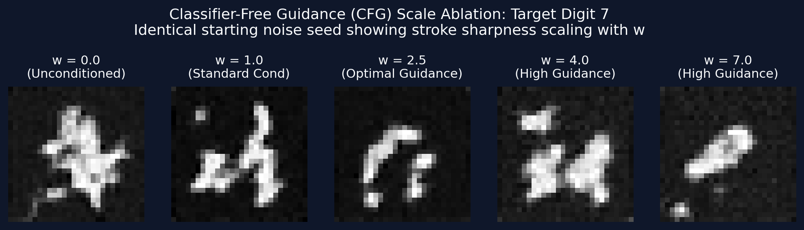

```powershell
# Commands to run Stage 3
cd 03_conditional_cfg
..\.venv\Scripts\python.exe train.py --dataset mnist --epochs 6 --p_uncond 0.15
..\.venv\Scripts\python.exe sample.py --checkpoint checkpoints/mnist_cfg_ddpm_mnist.pt --guidance_scale 3.0
```

---

### Stage 4: Accelerated Sampling with DDIM
- **Directory**: [`04_fast_sampling_ddim/`](./04_fast_sampling_ddim)
- **Goal**: Break the slow sampling barrier using non-Markovian forward processes (**15.8× speedup** without retraining) and deterministic ODE sampling ($\eta = 0$).

#### Sampling Speedup Benchmark
Generating digits across steps $S \in [5, 10, 20, 50, 100, 300]$:

| Steps ($S$) | Inference Time | Speedup Factor | Visual Quality |
|---|---|---|---|
| **5 steps** | **0.10s** | **49.9×** | Rough silhouettes form |
| **10 steps** | **0.17s** | **31.0×** | Recognizable strokes |
| **20 steps** | **0.33s** | **15.8×** | **Optimal sweet spot**: ~95% of full quality |
| **50 steps** | **0.91s** | **5.7×** | Indistinguishable from 300 steps |
| **300 steps (DDPM)** | **5.23s** | **1.0×** | Standard Markovian baseline |

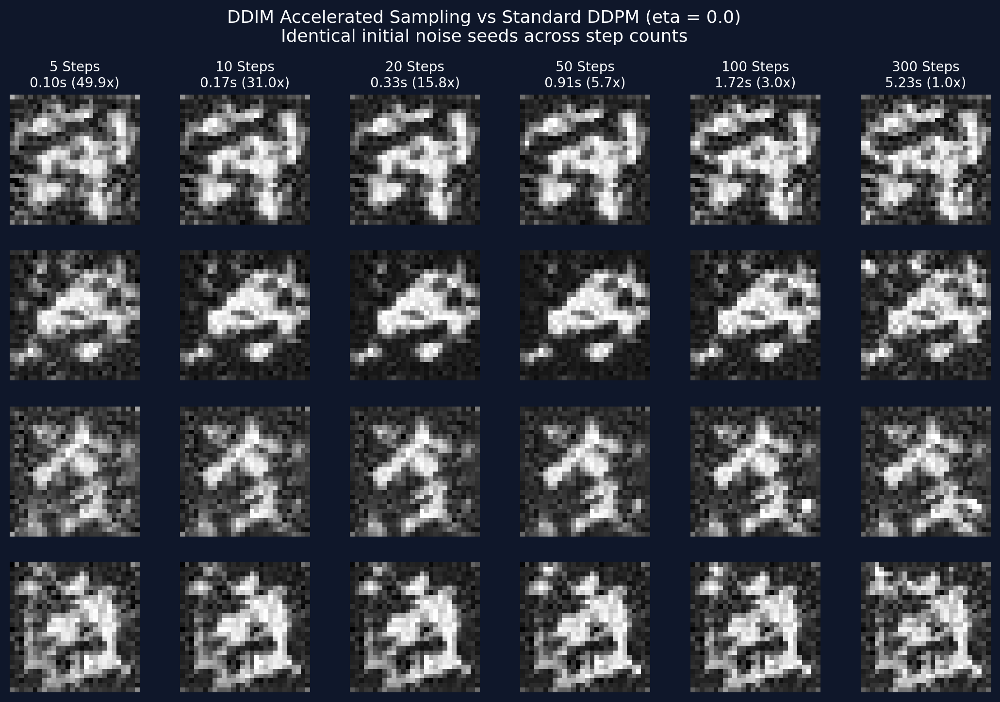

#### Deterministic Latent Space Morphing (SLERP)
Because $\eta=0.0$ turns sampling into an invertible ODE trajectory, spherical linear interpolation between two noise seeds produces a seamless morph from **Digit 3** into **Digit 8**:
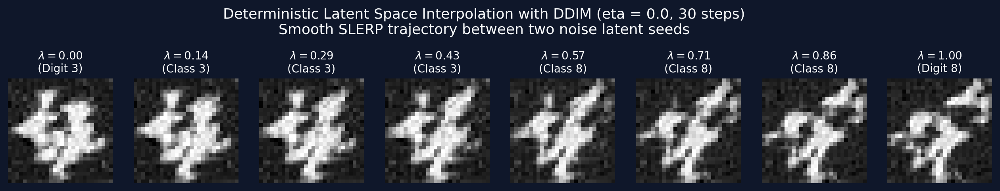

```powershell
# Commands to run Stage 4
cd 04_fast_sampling_ddim
..\.venv\Scripts\python.exe benchmark_steps.py --steps 5 10 20 50 100 300
..\.venv\Scripts\python.exe interpolate.py --digit_a 3 --digit_b 8 --frames 8 --steps 30
```

---

### Stage 5: Latent Diffusion Models (LDM / Stable Diffusion)
- **Directory**: [`05_latent_diffusion/`](./05_latent_diffusion)
- **Goal**: Scale diffusion to high resolutions by decoupling perceptual compression (Convolutional VAE) from semantic denoising (Latent U-Net with Cross-Attention).

#### VAE Perceptual Compression Inspection
Compressing $28 \times 28$ images into 4-channel $7 \times 7$ latent slices:
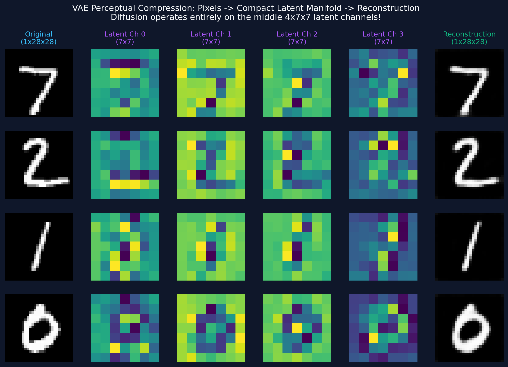

#### Inside the LDM: Latents to Decoded Pixels
Denoised $4 \times 7 \times 7$ latent channels decoded through the VAE decoder into crisp pixel images:
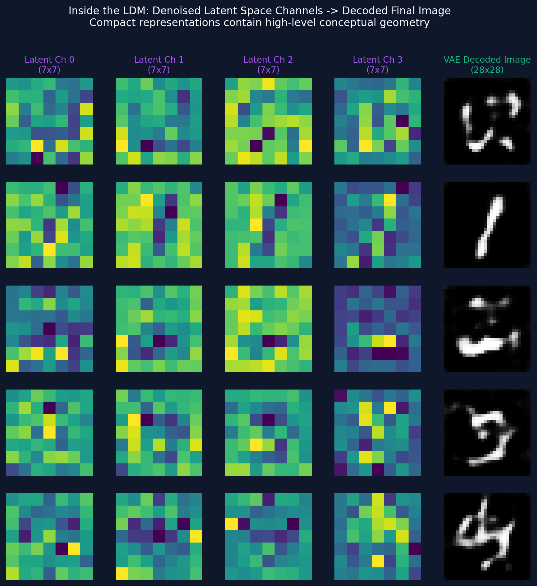

#### Synthesized Digits Showcase
Full end-to-end generation in 20 DDIM steps with CFG $w=3.0$:
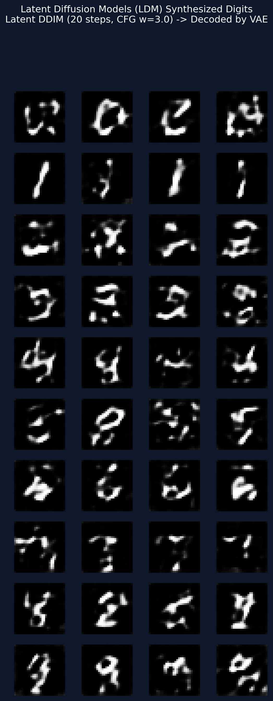

```powershell
# Commands to run Stage 5
cd 05_latent_diffusion
..\.venv\Scripts\python.exe train_vae.py --epochs 4
..\.venv\Scripts\python.exe inspect_compression.py
..\.venv\Scripts\python.exe train_ldm.py --epochs 5
..\.venv\Scripts\python.exe sample_ldm.py --steps 20 --guidance_scale 3.0
```

---

## 🚀 Environment Setup

```powershell
cd diffusion_models

# Virtual environment is already created at .venv
# Activate in PowerShell:
.\.venv\Scripts\Activate.ps1

# Or run directly via:
.\.venv\Scripts\python.exe <script.py>
```

---

## 🔮 Future Improvements & Research Ideas

Now that you have mastered all 5 core stages, here are exciting directions to take this codebase:
1. **Text-to-Image Conditioning**: Replace class embeddings in Stage 5 with pre-trained **CLIP text embeddings** to prompt with natural language.
2. **Inpainting**: Mask out regions of an image and sample the unmasked regions conditionally using DDIM inversion.
3. **ControlNet**: Add zero-convolution control branches to guide generation with edge maps (Canny) or sketches.
4. **Flow Matching (Rectified Flow / Flux)**: Transition from curved diffusion paths to straight optimal transport trajectories ($x_t = (1-t) x_0 + t x_1$).
