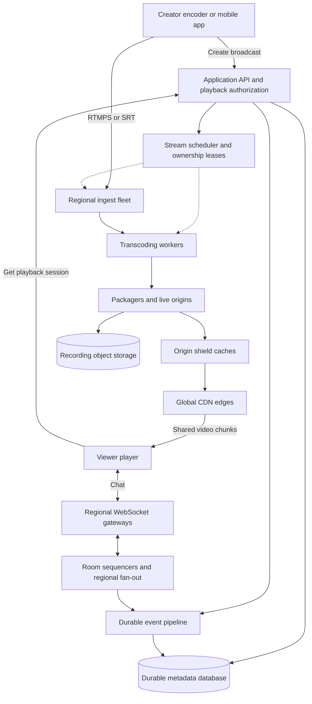
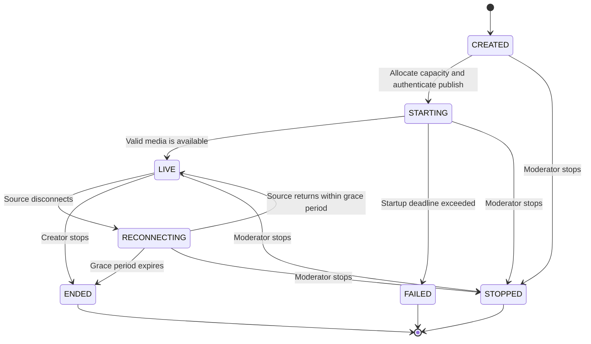

# Live Streaming Platform: Architecture and System Specification

Version: 1.0 | Date: 2026-09-30 | Status: proposed design for review

This document explains how a platform can support many simultaneous streamers and a very large viewing audience. It defines an illustrative system, its requirements, capacity model, operational behavior, and implementation stages. It is a planning document; no services have been deployed or benchmarked.

The design uses publicly documented streaming mechanisms. It does not claim to reproduce TikTok's or YouTube's private infrastructure, traffic figures, hardware allocation, or operating costs. Unless explicitly attributed, numbers below are proposed requirements or calculations from assumptions, not measurements of those companies.

## Contents

1. [How the system scales](#1-how-the-system-scales)
2. [Scope and assumptions](#2-scope-and-assumptions)
3. [Product requirements](#3-product-requirements)
4. [Service objectives](#4-service-objectives)
5. [System architecture](#5-system-architecture)
6. [Streaming protocols and latency](#6-streaming-protocols-and-latency)
7. [Broadcast lifecycle](#7-broadcast-lifecycle)
8. [Ingest and media processing](#8-ingest-and-media-processing)
9. [CDN and origin specification](#9-cdn-and-origin-specification)
10. [Player specification](#10-player-specification)
11. [Chat and interactions](#11-chat-and-interactions)
12. [Data model and APIs](#12-data-model-and-apis)
13. [Capacity planning](#13-capacity-planning)
14. [Scaling and placement](#14-scaling-and-placement)
15. [Reliability and recovery](#15-reliability-and-recovery)
16. [Security and moderation](#16-security-and-moderation)
17. [Recording and analytics](#17-recording-and-analytics)
18. [Operations and observability](#18-operations-and-observability)
19. [Cost model](#19-cost-model)
20. [Technology and delivery plan](#20-technology-and-delivery-plan)
21. [Validation and acceptance](#21-validation-and-acceptance)
22. [Decisions still needed](#22-decisions-still-needed)
23. [Glossary and references](#23-glossary-and-references)

## 1. How the system scales

A creator uploads one encoded video feed. A processing pipeline produces a small set of quality levels and divides them into shared media chunks. CDN servers distribute and cache those chunks close to viewers. Each viewer normally downloads one quality level at a time and switches quality as network conditions change.

The workload has several independent dimensions:

| Workload | Main scaling driver | Example |
|---|---|---|
| Receiving video | Active streamers and upload bitrate | 10,000 creators each uploading 6 Mbps |
| Encoding video | Active streamers, resolutions, frame rates, codecs | Four output qualities per active broadcast |
| Delivering video | Viewers and selected bitrate | 1 million viewers each receiving 2.5 Mbps on average |
| Chat | Connections, messages, and recipients per message | A popular room creates concentrated fan-out |
| Application APIs | Joins, discovery, moderation, token refresh | A notification produces a burst of playback requests |
| Recording | Broadcast hours, recorded bitrate, retention | Every stream may generate a replay |

Adding viewers to an existing broadcast does not normally require encoding that broadcast again. Adding another streamer does require another media pipeline. One huge broadcast and thousands of small broadcasts therefore stress different parts of the platform.

A CDN reduces repeated upstream downloads, but every viewer still consumes delivery bandwidth. Its benefit comes from distributing that work and reusing shared media objects. The origin is the service that supplies these objects to the CDN; it does not send a separate personalized video feed to every viewer.

Origin shielding and consolidation of simultaneous requests are documented mechanisms for reducing duplicate fetches. [AWS: Origin Shield](https://docs.aws.amazon.com/AmazonCloudFront/latest/DeveloperGuide/origin-shield.html).

## 2. Scope and assumptions

### Planning baseline

| Parameter | Proposed baseline |
|---|---|
| Peak simultaneous viewers | 1,000,000 platform-wide |
| Peak simultaneous broadcasters | 10,000 |
| Hot-room test | 500,000 viewers in one broadcast, within the platform total |
| Delivery footprint | Global CDN; regional processing introduced in stages |
| Initial media format | H.264 video and AAC audio, up to 1080p30 |
| Source bitrate for sizing | 6 Mbps total per broadcaster |
| Average viewer bitrate for sizing | 2.5 Mbps total, including audio |
| Output ladder | Up to four qualities; approximately 10 Mbps aggregate for sizing |
| Default viewing delay | Low-latency broadcast; p95 goal at most 8 seconds |
| Interactive participants | Optional room of up to 8 hosts/guests; separately sized |
| WebSocket connections | Budget up to 1 million concurrently |
| Large join burst | 100,000 viewers in 10 seconds |

These are adjustable planning inputs. They do not imply that every streamer has 100 viewers: audience distribution is expected to be highly uneven. Separate long-tail, hot-room, and platform-wide tests are required.

The initial product is public one-to-many broadcasting with authenticated creators. Private broadcasts, co-hosts, and recording are explicit extensions. Gifts, subscriptions, advertising, 4K, 60 fps, and recommendation models need separate product and engineering specifications.

## 3. Product requirements

| ID | Requirement |
|---|---|
| FR-01 | An authorized creator can create a broadcast and obtain publish credentials. |
| FR-02 | The system accepts compatible encoded video, checks input limits, and reports stream health. |
| FR-03 | Viewers can discover live broadcasts and play them on supported web, iOS, and Android clients. |
| FR-04 | The player switches quality automatically and also permits manual selection. |
| FR-05 | Creators and moderators can stop a broadcast; new playback must then be denied. |
| FR-06 | Viewers can join chat, send permitted messages, report content, and receive moderation actions. |
| FR-07 | A temporary creator disconnect shows a reconnecting state before the broadcast ends. |
| FR-08 | Viewer counts are approximate and update without synchronous database writes per viewer. |
| FR-09 | Optional recording produces a replay only after validation and privacy checks. |
| FR-10 | Private playback, when enabled, checks entitlement before issuing access credentials. |
| FR-11 | Optional hosts/guests use a real-time media path; the public audience receives a mixed broadcast. |

Maximum chat message: 1 KiB UTF-8 text. Default creator input: at most 1080p30 and 8 Mbps total, with a 2-second keyframe interval. These are platform policy limits for this design, not protocol limitations.

## 4. Service objectives

These are launch targets to validate, not promised performance. Define supported devices and network conditions before measurement; publish results by geography, device, ISP, and application version.

| Metric | Proposed objective | Measurement |
|---|---|---|
| Playback authorization API | 99.95% successful requests per month | Valid authorized requests excluding deliberate policy rejection |
| Playback start success | At least 99.9% | First frame within 10 seconds after a valid play request |
| Time to first frame | p95 at most 3 seconds | Player play request to displayed frame; exclude intentional user pauses |
| Broadcast delay | p50 3-5 seconds; p95 at most 8 seconds | Capture-to-display measurement using synchronized clocks or test watermarks |
| Rebuffering ratio | Aggregate at most 0.5% | Stall duration divided by watched duration, with cohort breakdowns |
| Chat delivery | p95 at most 500 ms within region; 1 second cross-region | Accepted message to connected eligible recipient |
| Worker crash recovery | p95 fresh video within 10 seconds | With a healthy source and reserved replacement capacity |
| Creator reconnect grace | 30 seconds | Policy timer after source loss |
| Moderator stream stop | p95 no fresh media access within 10 seconds | Edge denial and producer shutdown, tested across delivery regions |

Playback and delay goals assume a connection able to sustain an available rendition. Poor uplinks, offline clients, and unsupported devices remain visible in user-experience reporting even where service attribution separates their cause.

An API SLO does not establish video availability. Measure actual playback separately. Already downloaded video can remain visible after a moderation stop; the stop objective concerns future delivery, not remote deletion of client buffers.

## 5. System architecture



The diagram shows logical components, not one machine per box. An MVP can run several application responsibilities together. Media fleets, chat gateways, and APIs need separate capacity budgets.

| Plane | Responsibility | Scaling and isolation |
|---|---|---|
| Control | Identity, broadcast metadata, ownership, playback access | Stateless API replicas; transactional metadata |
| Media | Ingest, encoding, packaging, video delivery | Stateful stream placement; dedicated media workers; CDN |
| Interaction | Chat, presence, reactions, moderation notifications | Connection gateways plus room-based routing |
| Data | Recording, events, analytics | Asynchronous processing and storage |

Application APIs return playback locations and credentials. Media downloads go directly through the CDN. Databases and event brokers hold metadata and events rather than the live video byte stream.

Active playback can survive a short application API outage while credentials remain valid and the media pipeline is healthy. New joins and credential renewal still depend on the control plane.

## 6. Streaming protocols and latency

| Path | Proposed protocol | Purpose and tradeoff |
|---|---|---|
| Desktop creator upload | RTMPS | Familiar encoder workflow with transport encryption |
| Professional upload, optional | SRT with encryption configured | Recovery from packet loss with a configurable delay budget |
| Browser host/guest, optional | WebRTC | Interactive audio/video; needs signaling, relay capacity, and media servers |
| Mass audience | LL-HLS over HTTPS using fragmented MP4/CMAF-compatible media | CDN distribution with short media parts |
| Compatibility fallback | Regular HLS over HTTPS | More buffering and usually greater delay |
| Chat | WebSocket over TLS | Persistent bidirectional message connection |

HLS distributes playlists describing downloadable media. Low-Latency HLS adds mechanisms including media parts and blocking playlist reloads. The initial configuration is 2-second segments and 500-ms parts; actual player hold-back values and server behavior must satisfy the protocol and selected SDKs. [Apple: LL-HLS](https://developer.apple.com/documentation/http-live-streaming/enabling-low-latency-http-live-streaming-hls), [Apple: blocking playlist reload](https://developer.apple.com/videos/play/wwdc2020/10231/).

Use WebRTC for the small interactive stage when hosts need fast conversation. An SFU forwards participant media without decoding every feed. A compositor mixes stage participants into one encoded program for the broadcast pipeline. Public viewers then use the CDN path. Sending the entire million-viewer audience through WebRTC is a separate architecture with different connection, relay, congestion-control, and cost requirements.

An illustrative delay budget is 0.5 seconds for capture/upload, 0.5 for processing, 0.5 for part publication, 0.5 for distribution, and 2-3 for player buffering: roughly 4-5 seconds. Components overlap and tail delays vary; measure the complete path rather than treating this sum as a guarantee.

Lower delay leaves less playback buffer to absorb network problems. YouTube documents low-latency and ultra-low-latency viewing modes and this tradeoff; it does not provide a blanket sub-second broadcast guarantee. [YouTube: live streaming latency](https://support.google.com/youtube/answer/7444635?hl=en).

## 7. Broadcast lifecycle

Persistent channel identity and individual broadcast sessions are separate. Reusing a channel does not reuse old segment names or ownership epochs. YouTube's public API also distinguishes broadcast events from ingest streams; the model here is our own. [Google: broadcasts and streams](https://developers.google.com/youtube/v3/live/broadcasts-and-streams).



Sequence:

1. Creator creates a session; the API authorizes ownership and records an idempotency key.
2. Scheduler reserves media capacity and assigns an ingest region and an ownership lease.
3. API issues an expiring, broadcast-scoped publish credential. Desktop stream keys can be revocable secrets stored as hashes; rotation ends their future use.
4. Encoder connects. Ingest checks credentials, codec, timestamps, bitrate, and duplicate publishing.
5. Workers generate aligned renditions; the packager makes media readable before publishing playlist references.
6. Session becomes LIVE only after playable media exists. Discovery receives an asynchronous status event.
7. Viewer requests a playback session; API checks visibility and returns CDN playback information and access credentials.
8. Video begins through the CDN; chat connects separately.
9. Ending closes ingest, finalizes playlists and any recording, releases leases, and emits a durable status event.

Every asynchronous event carries broadcast ID, event ID, version, and timestamp. Consumers tolerate duplicates and ignore stale lifecycle versions. A late worker must never revive a stopped session.

## 8. Ingest and media processing

### Ingest

Route creators to a reachable regional endpoint using measured network quality and capacity. Keep ingest close to its processing pipeline. Geographic closeness alone does not guarantee the best route.

Validate upload policy and reject incompatible streams with a clear creator-facing reason. Track timestamp discontinuities, audio presence, bitrate, keyframe intervals, and dropped frames. Forward compressed input to workers; decoded raw video would require much more internal bandwidth than the source bitrate.

Each broadcast has one authorized producer epoch. A lease service assigns ownership and increments a fencing token during failover. Packagers reject writes from older epochs. Avoid putting a network database request on every frame or part; distribute authorization and ownership state with bounded refresh intervals.

Maintain connection limits, file-descriptor budgets, NIC headroom, and protocol-specific health checks. Stateful connections require draining during deployments. A broken connection generally needs client reconnect unless redundant publishing was established in advance.

### Encoding ladder

| Rendition | Landscape example | Video bitrate | Frame rate |
|---|---|---|---|
| High | 1920 x 1080 | 4.5 Mbps | 30 fps |
| Medium | 1280 x 720 | 2.5 Mbps | 30 fps |
| Low | 854 x 480 | 1.2 Mbps | 30 fps |
| Minimum | 640 x 360 | 0.65 Mbps | 30 fps |

Use AAC at approximately 128 kbps. For this capacity model, audio is included in each delivered rendition. Portrait content preserves its aspect ratio using equivalent pixel budgets. Do not upscale a low-resolution source merely to populate the ladder.

Start with H.264 for compatibility. Evaluate additional codecs only after measuring device support, encoding cost, and delivery savings. CPU and GPU workers are both options; benchmark the whole decode, scale, encode, and package pipeline with representative content.

Align keyframes and segment boundaries across renditions. A 500-ms part need not begin with an independently decodable keyframe. Avoid forcing keyframes every part without measuring the compression cost. Normalize A/V timestamps and introduce playlist discontinuities when a restart changes the timeline.

Existing live work has priority over new starts. Reject or defer new broadcasts when reserved capacity is exhausted. If a broadcaster has no viewers, a documented policy may use fewer renditions and expand on demand; provision warm capacity so the first viewers do not wait for a cold fleet startup.

## 9. CDN and origin specification

### Media addressing and cache rules

Example immutable media path:

```text
/live/{broadcast_id}/{epoch}/{rendition}/seg-{sequence}-part-{part}.m4s
```

Never overwrite a published media URL with different bytes. Include session and epoch identifiers to avoid collisions after restart. Initialization segments are versioned when codec configuration changes.

| Resource | Proposed policy |
|---|---|
| Immutable media and initialization segments | Shared cache; initial TTL 5 minutes; origin retention at least 10 minutes |
| Ordinary current media playlist | Initial cache TTL at most 500 ms; tune against measured delay |
| Blocking LL-HLS playlist reload | Preserve delivery directives; coalesce identical requests; return only a sufficiently advanced playlist |
| Versioned master playlist | Cache briefly; version on ladder or codec changes |
| Playback-session API response | Private and non-cacheable |
| Not-yet-published media errors | Disable or sharply limit negative caching to avoid freezing the live edge |

The 10-minute origin retention assumes a short live playback window and bounded retry period. DVR needs longer retention and revised manifests. Cache TTL is distinct from media duration. Do not give all playlist variants the immutable-media cache policy.

### Authentication without destroying sharing

Authorize each private media request at the edge, before serving a cache hit. Exclude user-specific access credentials from the shared media cache key only after their validation. A normal origin-only authorization check is insufficient because cache hits bypass that origin.

Signed cookies can authorize a group of media objects without changing their URLs. Native clients or deployments that cannot reliably use cookies can use a validated token with equivalent cache behavior. [AWS: signed cookies](https://docs.aws.amazon.com/AmazonCloudFront/latest/DeveloperGuide/private-content-signed-cookies.html).

Tokens include broadcast scope, expiry, and entitlement version. Initial validity is 5 minutes; clients refresh with jitter before expiry. Rapid moderation requires an edge-propagated stop/revocation state; token expiry alone cannot meet a 10-second stop target. Private origins accept requests only from the permitted delivery infrastructure.

Keep content-changing query parameters in the cache key. In particular, `_HLS_msn`, `_HLS_part`, and applicable `_HLS_skip` directives affect playlist responses and must retain their meaning. Bound out-of-range directives and excessive requests to protect origins. Configure CDN and load-balancer timeouts to support valid blocking requests.

### Hot-room protection and multiple CDNs

Use hierarchical caches, an origin shield near the processing region, and consolidation of identical requests. Many viewers requesting the same new object should produce a bounded number of upstream fills per cache hierarchy, not one origin request per viewer. Multiple cache nodes, different keys, evictions, retries, and separate CDNs can still fetch more than one copy.

Expect lower cache reuse for small broadcasts. Measure hit ratios separately for immutable media, playlists, popular rooms, and the long tail; a universal 99% hit-rate assumption is inappropriate.

For later production stages, return healthy primary and fallback CDN pathways. Switch using player-observed failures and regional quality signals with hysteresis. Keep media naming, authorization, and timelines compatible across pathways. A second CDN needs contracted capacity and a tested origin-fill budget; simply adding a second URL does not provide resilience.

## 10. Player specification

Support native HLS where suitable and a vetted web player for other supported browsers. Pin supported SDK versions during implementation and test low-latency behavior on real devices.

The player must:

- Start on a conservative quality and increase it using measured throughput and buffer health.
- Maintain a configurable live buffer and catch up gradually when it drifts behind the live edge.
- Retry transient media errors with bounded backoff; switch pathways when the current CDN is unhealthy.
- Refresh credentials with randomized timing and recover from expiry without an unnecessary full restart.
- Handle encoder discontinuities, reconnecting sessions, moderator stop, and normal stream completion.
- Expose manual quality selection, mute, accessibility controls, and mobile data preferences.
- Report startup time, stalls, fatal errors, selected quality, buffer depth, and estimated live delay.

A feed with autoplay previews requires a separate budget for prefetch traffic. Limit simultaneous active video decoders and stop downloads for off-screen items. Count active downloading playback sessions rather than page visits as delivery concurrency.

Chat normally arrives faster than video. Messages may carry a media-time reference for optional synchronized display; otherwise disclose that chat and video are not perfectly aligned. Financial outcomes and moderation decisions must not depend on a client's local video clock.

## 11. Chat and interactions

Regional WebSocket gateways own client connections. A room routing layer owns ordering, moderation, and fan-out. Send a room event once to each subscribed regional gateway group, then distribute it locally; do not send every client delivery through a central database.

Partition ordinary rooms by broadcast ID. A hot room uses a dedicated sequencer and a distribution tree. Split its downstream recipients across gateways while preserving the sequence assigned to accepted messages. If one sequencer becomes a bottleneck, apply a room-level message budget before adding ordering partitions; global ordering across independently partitioned writers is a separate complexity.

### Chat policy

| Behavior | Initial rule |
|---|---|
| User send limit | 1 message/second sustained; burst of 5 |
| Platform capacity input | Illustrative 10,000 accepted chat messages/second total |
| Normal room | Deliver accepted messages subject to bounded room and gateway budgets |
| Hot room | Curated public feed of at most 10 messages/second per viewer |
| Moderator traffic | Separate priority channel and full accepted-message audit access |
| Reactions | Aggregate counts in approximately 1-second windows |
| Slow client | Bounded queue; drop ephemeral reactions first, then disconnect if necessary |
| Reconnect | Resume from last sequence where a short replay buffer is available |

The hot-room feed cap is a product behavior: sending does not guarantee display to every audience member. Return an acknowledgement to the sender and explain any visibility restrictions. Apply spam filtering, slow mode, and moderation before choosing the public feed. Do not silently discard financially meaningful events.

Messages have server IDs, client IDs for deduplication, room sequence, and server timestamps. Delivery can duplicate during retries, so clients deduplicate. Ordering is per room or explicit ordered partition, not global across all broadcasts. Retention and moderation access follow the policy in Section 17.

Presence uses periodic heartbeats and expiry in regional stores. Aggregate counts asynchronously, with deduplication where sessions move regions. Label counts approximate; avoid rewriting one shared room counter on every heartbeat.

If gifts or payments are added, use an independent transactional ledger, idempotent processing, and authenticated payment-provider events. Chat notifications reference committed transactions rather than determining balances.

## 12. Data model and APIs

### Logical records

| Record | Principal fields | Store and consistency |
|---|---|---|
| User/channel | ID, owner, status, permissions | Transactional database |
| Broadcast | ID, channel ID, state, version, region, visibility, recording flag | Transactional database; compare-and-set transitions |
| Publish credential | Credential hash, scope, expiry, revocation | Protected credential store |
| Media assignment | Broadcast ID, worker, epoch, lease expiry | Lease service; atomic ownership updates |
| Playback session | Session ID, broadcast ID, access expiry, CDN choices | Expiring distributed state where needed; stateless tokens for media access |
| Chat message | Message ID, client ID, room ID, sequence, moderation status | Event stream and time-bounded history store |
| Presence | Session ID, room ID, region, last heartbeat | TTL-based regional store; eventual counts |
| Recording | ID, broadcast ID, object prefix, state, retention expiry | Metadata database plus object storage |
| Moderation action | Actor, target, reason, timestamp, policy version | Durable audit record |

Keep durable metadata separate from disposable caches. Cache loss may temporarily affect counts and lookups, but must not erase broadcast ownership or committed transactions. Avoid a single Redis instance as the platform's source of truth.

### Proposed API surface

| Endpoint | Purpose |
|---|---|
| `POST /v1/broadcasts` | Create broadcast with an idempotency key |
| `POST /v1/broadcasts/{id}/publish-sessions` | Obtain authorized ingest endpoint and publish credential |
| `GET /v1/broadcasts/{id}` | Read status and permitted metadata |
| `GET /v1/live?cursor=...` | Read a paginated discovery projection |
| `POST /v1/broadcasts/{id}/playback-sessions` | Check access and return playback configuration |
| `POST /v1/playback-sessions/{id}/refresh` | Renew access after rechecking policy |
| `POST /v1/broadcasts/{id}/end` | End own broadcast idempotently |
| `POST /v1/broadcasts/{id}/reports` | Submit a viewer report |
| `POST /v1/moderation/broadcasts/{id}/stop` | Authorized stop and access revocation |
| `WSS /v1/chat` | Authenticate, join/leave rooms, send/receive messages |

Example playback configuration, deliberately without credentials in logged URLs:

```json
{
  "playback_session_id": "ps_example",
  "broadcast_id": "b_example",
  "state": "LIVE",
  "protocol": "ll-hls",
  "primary_url": "https://video.example.com/live/b_example/e1/master.m3u8",
  "fallback_url": "https://backup.example.com/live/b_example/e1/master.m3u8",
  "credential_delivery": "secure-cookie",
  "expires_at": "2026-09-30T12:05:00Z",
  "target_live_delay_seconds": 4,
  "chat_url": "wss://chat.example.com/v1/chat"
}
```

Actual cookies are set in response headers. A native-client profile specifies token transport separately. For a single-CDN MVP, omit the fallback field. Use bounded timeouts, rate limits, and request IDs. Return `409` for invalid state transitions, `429` for policy rate limits, and `503` for unavailable capacity, with retry guidance where appropriate.

## 13. Capacity planning

All bandwidth and storage units below are decimal: 1 GB = 1,000,000,000 bytes. Rates are payload estimates unless overhead is explicitly added. CPU, memory, request limits, and NIC limits require measurement.

Let `S` be active streamers, `V` viewers, `b_in` source Mbps, `b_view` average delivered Mbps, `b_ladder` aggregate output Mbps, `R` renditions, and `p` part duration in seconds.

```text
Ingest Gbps                 = S * b_in / 1,000
Processed output Gbps       = S * b_ladder / 1,000
Viewer delivery Gbps        = V * b_view / 1,000
GB per viewer-hour          = b_view * 3,600 / 8 / 1,000
Media part publications/sec = S * R / p
Viewer media requests/sec   = V / p   [one selected, multiplexed rendition]
```

### Baseline calculations

| Item | Calculation | Result |
|---|---|---|
| Creator ingest | 10,000 x 6 Mbps | 60 Gbps |
| Four-rendition output | 10,000 x approximately 10 Mbps | Approximately 100 Gbps |
| Viewer delivery | 1,000,000 x 2.5 Mbps | 2.5 Tbps |
| Delivery with 15% network allowance | 2.5 Tbps x 1.15 | 2.875 Tbps |
| Viewer-hour data | 2.5 x 3,600 / 8 / 1,000 | 1.125 GB |
| Data per hour at peak | 1,000,000 x 1.125 GB | 1.125 PB |
| 500-ms part publications | 10,000 x 4 / 0.5 | 80,000 parts/second |
| 2-second full segment publications | 10,000 x 4 / 2 | 20,000 segments/second |
| Viewer part downloads | 1,000,000 / 0.5 | 2,000,000 requests/second at CDN edges |
| Blocking playlist updates | Up to one per part per viewer in this model | Up to another 2,000,000 edge requests/second |
| Playback join burst | 100,000 / 10 seconds | 10,000 playback starts/second |
| 30-second presence heartbeat | 1,000,000 / 30 | Approximately 33,333 heartbeats/second |
| 5-minute credential renewal | 1,000,000 / 300 | Approximately 3,333 renewals/second on average |

Request counts vary with player behavior, part grouping, byte ranges, separate audio, and implementation. They illustrate why short parts affect request cost and connection capacity, not just bandwidth. Avoid downloading both every part and its full segment during steady playback. Packaging publications are not automatically object-storage PUTs: serve the live window from an appropriate origin and record larger objects asynchronously if small writes are too expensive.

### Origin load

For a set of watched streams, origin media bandwidth is approximately the sum of requested rendition rates multiplied by effective independent cache-fill copies. It is not necessarily viewer bandwidth multiplied by one universal miss ratio.

If all baseline renditions are requested through one effective shield copy, approximately 100 Gbps of produced media can flow upstream to that shield. Two independent delivery hierarchies could require roughly twice that before replication, retries, and overhead. Long-tail traffic with little reuse can approach its actual viewer traffic. Measure playlists and media separately and test cold caches.

### Illustrative worker count

Assume, solely as a sizing example, a benchmark finds that one worker supports 20 full four-rendition 1080p30 input pipelines. At a target utilization of 60%:

```text
Required workers = ceil(10,000 / (20 * 0.60)) = 834
```

With 278 workers in each of three availability zones, losing one zone leaves capacity for 11,120 streams at full benchmark throughput. Serving 10,000 would use about 90% of surviving capacity. This arithmetic assumes workloads can relocate, adequate network capacity, and comparable workers; it does not guarantee uninterrupted playback. The assumed 20-stream benchmark is not a GPU specification.

### Chat fan-out

At 500,000 viewers and a public feed of 10 messages/second:

```text
Deliveries/sec = 500,000 * 10 = 5,000,000
At 300 bytes/event: payload = 1.5 GB/sec = 12 Gbps
```

Protocol overhead and retransmission increase this. Delivering 10,000 messages/second to the same room would instead create 5 billion deliveries/second. Room feed policy is therefore both a usability and capacity requirement.

If a benchmark supports 20,000 WebSockets per gateway, 1 million connections need 50 gateways at full tested load. A 60% utilization target gives 84 gateways. Message fan-out, TLS CPU, and NIC limits may demand more; idle-connection benchmarks alone are insufficient.

## 14. Scaling and placement

Scale each component on the resource it consumes:

| Component | Signals | Response |
|---|---|---|
| Ingest | Concurrent publishers, throughput, sockets | Add reachable ingest nodes; route new sessions; drain existing ones |
| Encoder | Reserved pipeline slots, processing delay, accelerator/CPU use | Prewarm workers; admit only supported workloads |
| Packager/origin | Active renditions, part publication delay, request rate, NIC use | Shard by broadcast; maintain redundant origin routes |
| Application API | Requests/second, latency, saturation | Add stateless replicas; cache safe shared metadata |
| Chat gateway | Connections, send queues, messages, NIC use | Add gateways; redistribute joins; drain old sockets |
| Room routing | Accepted message rate and recipients | Isolate hot rooms; apply room feed budgets |
| Events/storage | Partition lag and write throughput | Expand partitions and consumers; manage retention |

Give each broadcast a processing home. Place ingest, encoding, and origin near each other to reduce cross-region media transfer. Deploy multiple availability zones within a home region. Other regions can own their own broadcasts while viewers use global CDN edges.

Autoscaling takes time. Reserve warm slots, preapprove provider quotas, and schedule known events. Scale on workload admission and leading indicators, rather than waiting for every worker to reach saturation. Do not migrate a live pipeline solely to rebalance small utilization differences.

Hot rooms need dedicated downstream fan-out and delivery planning. Many low-audience streams need efficient encoding and packaging. The CDN still routes geographically distributed viewers appropriately, even if a room has only a few viewers; viewer count does not dictate one fixed edge location.

## 15. Reliability and recovery

| Failure | Expected behavior | Recovery mechanism and limit |
|---|---|---|
| Creator uplink loss | Fresh video stops; player shows reconnecting | Encoder reconnect within 30-second grace; no backend can recreate missing source video |
| Ingest crash | Source connection breaks | Client reconnect to another node; redundant source publishing only if configured |
| Encoder crash | Fresh output stalls | Lease-fenced replacement worker reads healthy input; fresh-video recovery target 10 seconds |
| Packager/origin failure | Cached media plays briefly, then live edge stalls | Healthy origin replica/failover; versioned discontinuity if timeline changes |
| CDN regional degradation | Affected viewers see errors/stalls | Player switches to tested fallback pathway using measured health |
| Chat gateway crash | Socket disconnect | Jittered reconnect and bounded message replay |
| Metadata database outage | New mutations may fail | Existing media continues where credentials and assignments are already available |
| Event pipeline lag | Discovery and analytics become stale | Bound buffers; degrade nonessential analytics before media |
| Availability-zone loss | Streams may pause during reassignment | Reserve surviving-zone capacity; test source forwarding and ownership fencing |
| Whole processing region loss | Streams homed there may stop | Reconnect to another region; full continuity requires separate capacity and a surviving source path |

Multi-region recovery is not achieved by copying old segments. Continuous regional failover needs a source feed available in the surviving region, reserved encoding/packaging capacity, and a workable timeline transition. For premium events, consider preconfigured redundant publishers and hot standby pipelines, with explicit extra cost.

Ordinary sessions target cross-region restart within 2 minutes when the creator can reconnect and fallback capacity is reserved. This does not meet a 10-second worker-failure objective and should be reported separately. All-region simultaneous continuity is outside the baseline commitment.

Proposed durable metadata objectives are RPO at most 1 minute and regional restoration within 15 minutes, using validated replication/backups. These are independent from live-media recovery. Transactional payment data, if added, needs its own durability requirements.

Degrade by pausing previews and nonessential analytics, aggregating reactions more aggressively, increasing playback buffer when appropriate, and admitting fewer new streams. Under encoding pressure, preserve a low-bandwidth rendition and consider suspending the highest quality. Changing segment configuration midstream needs a controlled discontinuity and player compatibility testing.

## 16. Security and moderation

Authenticate creator and moderator actions; enforce channel ownership and roles on every relevant API. Encrypt media transport where the selected protocol permits it. Store credentials in managed secret storage, redact them from telemetry, and rotate them after suspected exposure.

Apply upload bitrate limits, API rate limits, chat quotas, connection admission controls, and delivery-layer abuse protection. Viewer tokens should be short-lived and broadcast-scoped; a shared URL alone must not grant access to private content. Test revocation against both cold and warm CDN caches.

Moderation combines viewer reports, creator controls, operator actions, and optional automated analysis. Run automated analysis on a lower-resolution branch so it does not block the primary encoder. A synchronous safety review would add viewing delay and needs an explicit product requirement.

A stop action writes durable state, fences producers, propagates edge access denial, invalidates affected discovery entries, and notifies chat. Revocation state must also cover old session/epoch URLs. Cached media is not automatically removed by stopping the encoder.

Protect logs, moderation evidence, personal data, and recordings with access controls and audit trails. Applicable retention, age, geographic access, copyright, and payment policies remain product/legal inputs rather than assumptions in this technical design.

## 17. Recording and analytics

Recording is opt-in at session creation. Default proposal: record the normalized high-quality output asynchronously; optionally retain source media for a separately approved workflow. Do not put recording finalization on the live playback path.

At the 6-Mbps source sizing rate, one stream-hour contains 2.7 GB. Recording 10,000 such streams continuously produces 27 TB/hour and 648 TB/day before replication. Seven days is 4.536 PB. These figures show a continuous peak scenario, not expected usage. Recording every rendition at 10 Mbps would produce 45 TB/hour. Choose recording format and retention before committing storage budgets.

Recording states are pending, processing, ready, failed, and deleted. Verify media integrity and permissions before exposing replay. Ended private broadcasts remain private in replay. Aborted or moderated broadcasts do not become public automatically.

Initial retention proposals: recordings 7 days, ordinary chat history 24 hours, detailed operational logs 7 days, aggregated analytics 90 days. Moderation evidence has a separate reviewed policy. These are configurable product choices; deletion must cover derived assets and follow documented backup expiry.

Client analytics reports use batching and sampling. Sample ordinary successful sessions while retaining error events at a higher rate subject to a bounded budget. Use an append-only ingestion pipeline and an analytical store; avoid per-second viewer writes to the transactional database.

Discovery and approximate viewer counts are asynchronous projections. Exact watch time requires session reconciliation and duplicate handling. Fraud detection and recommendations are downstream consumers and can be developed independently of delivery.

## 18. Operations and observability

Track source bitrate, dropped frames, keyframe alignment, worker pipeline lag, part publication delay, playlist age, origin errors, cache fills, CDN failures, player stalls, chat queues, and event-consumer lag.

Use request/session IDs to connect playback authorization with player telemetry. Sample high-cardinality broadcast diagnostics rather than labeling every metric with every viewer or broadcast ID. Detailed per-session investigation belongs in traces or logs with appropriate access controls.

Initial alert conditions include no new media for 3 seconds on an otherwise healthy source, publication delay over 1 second, rapid growth of gateway send queues, exhausted media admission capacity, and abnormal playback failures by region. Tune thresholds from observed noise and page on user impact and error-budget burn.

Maintain synthetic publishers and players in representative regions. Include real mobile and home-network probes where possible; cloud-only probes do not establish end-user quality. Capture-to-display testing should account for clock error.

Deploy media workers by draining sessions or canarying new starts. Roll out player and encoder changes to a small fraction of traffic, observe quality, then expand. Maintain playbooks for ingest failure, frozen playlists, bad cache configuration, CDN switching, token-refresh failure, and moderator-stop failure.

## 19. Cost model

Budget from traffic curves rather than peak viewers multiplied by an entire month. Use provider quotes and approved quotas before procurement.

```text
Delivery cost   = delivered GB * contracted price/GB
Request cost    = billable requests / billing unit * request price
Encoding cost   = worker-hours * worker-hour price
Recording cost  = stored GB-month * storage price + writes + reads + replication
Other costs     = ingest/internal transfer + origins/shields + chat + APIs
                  + databases + analytics + support and operations
```

The following prices are hypothetical sensitivity inputs, not current vendor rates or quotes:

| Scenario | Data | At $0.01/GB | At $0.05/GB |
|---|---|---|---|
| One viewer-hour at 2.5 Mbps | 1.125 GB | $0.01125 | $0.05625 |
| One hour at 1 million viewers | 1,125,000 GB | $11,250 | $56,250 |
| 720-hour month averaging 100,000 viewers | 81,000,000 GB | $810,000 | $4,050,000 |

These figures exclude overhead, requests, transcoding, chat, storage, replication, and taxes. They illustrate sensitivity to delivered bitrate and contracted transfer rates. Providers using delivered-minute billing require conversion to that model instead of applying a GB price.

Useful cost controls include measured bitrate ladders, selective recording, predictable reserved capacity, bounded preview prefetch, and adequate cache sharing. Additional codecs or viewer-assisted delivery require their own device, bandwidth, privacy, and economic evaluation; savings are not assumed here.

## 20. Technology and delivery plan

### Recommended starting strategy

For an initial product, use a managed live-video service and build the application, playback access, chat policy, moderation, and observability around it. This reduces initial media operations work. Evaluate a custom media pipeline later if measured cost, features, data control, or provider constraints justify it.

Amazon IVS documents managed low-latency broadcast and a separate real-time stage capability. Their latency descriptions are product capabilities under appropriate conditions, not guarantees for our clients. [AWS: IVS overview](https://docs.aws.amazon.com/ivs/latest/LowLatencyUserGuide/what-is.html).

Managed does not mean unlimited. The IVS quota page currently lists default regional limits of 100 concurrent streams and 15,000 concurrent views, adjustable through quota requests. The proposed baseline requires negotiated capacity and API quota planning. Do not call a provider's low-rate management API for every viewer or create a provider channel on each playback start. [AWS: IVS quotas](https://docs.aws.amazon.com/ivs/latest/LowLatencyUserGuide/service-quotas.html).

| Capability | Starting option | Scale consideration |
|---|---|---|
| Media pipeline | Managed live service | Confirm input formats, player requirements, quotas, recording, revocation |
| Custom pipeline, if justified | Benchmarked ingest, FFmpeg or media SDK workers, LL-HLS packager | Requires stateful scheduling and 24-hour operations |
| Video distribution | Managed service delivery or dedicated CDN | Multi-CDN only where the chosen origin/provider supports it |
| Application API | Team's supported backend stack | Keep stateless; separate from video bytes |
| Metadata | PostgreSQL or comparable managed transactional store | HA, backups, transactional state updates |
| Presence/cache | Sharded Redis-compatible service | Rebuildable state and bounded memory |
| Chat transport | WebSocket gateways and regional routing | Hot-room ordering and fan-out budgets |
| Durable events | Managed stream/log service | Partitioning, retries, and lag management |
| Recording | Object storage with lifecycle rules | Retention, privacy, small-object costs |
| Telemetry | Metrics, distributed tracing, and analytical storage | Sampling and cardinality limits |

This is a capability map, not a requirement to adopt every named technology. Managed service and custom pipeline configurations will differ; in particular, independent CDN routing and direct LL-HLS controls must be verified with the selected provider.

### Implementation stages

| Stage | Intended scale | Deliverables and exit criteria |
|---|---|---|
| Proof of concept | 10 streamers, 1,000 viewers | End-to-end publish/play; measure delay; test phone and web clients |
| MVP | 100 streamers, 10,000 viewers | Creator access, discovery, chat, reports, recording policy, basic recovery |
| Production growth | 1,000 streamers, 100,000 viewers | Multi-zone operation, hot-room policy, quotas, cost dashboards, practiced incident recovery |
| Large-scale release | 10,000 streamers, 1 million viewers | Contracted delivery capacity, multi-region placement, tested CDN contingency, ownership fencing, failure drills |

Stages are capacity milestones, not a delivery-date promise. A proof of concept may be feasible in weeks, but a large-scale release requires provider coordination, application work, performance measurement, client testing, and operational staffing. Estimate schedule after team size and scope are agreed.

## 21. Validation and acceptance

Testing is proposed work for implementation; these tests have not been run for a deployed platform.

| Test | Acceptance evidence |
|---|---|
| Functional lifecycle | Create, publish, reconnect, stop, and replay respect ownership and terminal states |
| Mixed media load | Full target active-stream count, supported inputs, and representative motion/portrait content |
| Audience load | Sustained contracted delivery capacity across target regions with playback SLO reports |
| Hot room | 500,000 viewers within total baseline; bounded origin fills and usable chat feed |
| Long tail | Thousands of low-audience broadcasts; origin and encoding capacity remain within budgets |
| Join storm | 100,000 joins in 10 seconds; controlled API, chat, and token-service queues |
| Cold cache | No viewer-proportional origin request storm for shared keys; measure separate-CDN fills |
| Worker/zone failure | Fenced producers; measured recovery and surviving capacity; no stale worker publishes |
| CDN impairment | Compatible fallback playback, bounded retry storms, authorization preserved |
| Moderator stop | Warm and cold edges deny future media within stop objective, including old URLs |
| Chat overload | Public feed cap, priority moderation, bounded queues, and sender acknowledgements |
| Authorization | Cross-broadcast credential misuse rejected; no private playback from shared cache |
| Recording/privacy | Valid replay permissions, retention expiry, deletion of derived assets |
| Client matrix | Supported browsers, phones, network loss, backgrounding, and low bandwidth |

Use several kinds of evidence: deterministic synthetic publishers for processing, distributed request generators for delivery, and real players for decoding, buffer behavior, and user experience. HTTP downloads alone do not establish successful video playback. Large delivery tests must be coordinated with providers and budgeted; staged testing and capacity commitments supplement, but do not replace, realistic performance evidence.

Maintain a 60-minute peak-load qualification and a 24-hour moderate-load soak proposal. Define permitted short incident windows, expected reconnect behavior, and failure criteria before running tests. Require an operational review of costs, quotas, alerting, rollback, and incident ownership before large-scale launch.

## 22. Decisions still needed

The baseline makes this proposal reviewable, but procurement and implementation need the following inputs:

1. Actual peak and average viewers, live creators, watch duration, and hot-room distribution.
2. Initial audience geography and supported devices, including portrait/landscape requirements.
3. Required delay and whether interactive hosts are in the first release.
4. Public versus private playback, monetization, and moderation policy.
5. Managed media versus custom pipeline preference, team capability, and budget ceiling.
6. Recording/DVR retention, privacy requirements, and deletion behavior.
7. Acceptable interruption during zone, region, and provider failures.
8. Measured per-worker capacity and provider-approved delivery/management quotas.

The initial recommendation is an MVP with managed media, a CDN-compatible broadcast player, separate chat, and strong playback telemetry. Grow using measured workloads and the milestones above. The million-viewer model provides a target architecture and budgeting framework, not a reason to provision peak infrastructure before demand exists.

## 23. Glossary and references

| Term | Meaning |
|---|---|
| Ingest | Receiving the creator's encoded media |
| Transcoding | Producing different formats, resolutions, or bitrates |
| Rendition / ABR ladder | One output quality / the available set of qualities |
| Segment / part | Downloadable media interval / shorter portion of a segment |
| Playlist / manifest | Document describing available media and playback information |
| CDN / edge | Distributed delivery network / server close to viewers |
| Origin / shield | Source of media objects / upstream cache reducing repeated origin fetches |
| SFU | Media server forwarding selected real-time participant streams |
| Glass-to-glass delay | Time from camera capture to viewer display |
| Fencing token | Increasing ownership epoch used to reject writes from stale producers |
| SLO / RPO | Service performance objective / tolerated amount of data loss in recovery |

Primary sources checked on 2026-09-30 are linked next to the claims they support. Provider documentation can change; revisit capabilities, quotas, and prices during implementation. No cited source establishes TikTok's private system design or the proposed capacity assumptions.
