# Large-Scale Live Streaming Architecture

## How TikTok & YouTube Handle Millions of Concurrent Viewers

---

## Table of Contents

1. [High-Level Overview](#1-high-level-overview)
2. [Core Architecture Layers](#2-core-architecture-layers)
3. [Ingestion Pipeline](#3-ingestion-pipeline)
4. [Transcoding & Adaptive Bitrate](#4-transcoding--adaptive-bitrate)
5. [Content Delivery Network (CDN)](#5-content-delivery-network-cdn)
6. [Streaming Protocols](#6-streaming-protocols)
7. [Real-Time Chat & Interactions](#7-real-time-chat--interactions)
8. [Scaling Strategies](#8-scaling-strategies)
9. [Fault Tolerance & High Availability](#9-fault-tolerance--high-availability)
10. [Monitoring & Observability](#10-monitoring--observability)
11. [Cost Considerations](#11-cost-considerations)
12. [Technology Stack Summary](#12-technology-stack-summary)

---

## 1. High-Level Overview

Large-scale live streaming platforms solve a fundamentally hard problem: **one streamer produces a single video feed, but millions of viewers must receive it simultaneously with sub-second latency, globally.**

The core insight is that this is NOT a 1-to-N direct connection problem. Instead, it's solved through a **hierarchical distribution tree** — the video is ingested once, transcoded into multiple quality levels, cached at the edge, and served from the nearest point to each viewer.

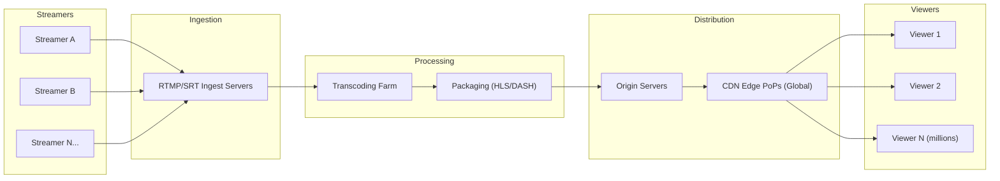

### Key Numbers at Scale (YouTube Live / TikTok Live)

| Metric | Approximate Scale |
|---|---|
| Concurrent live streams | 100,000+ at any given moment |
| Peak concurrent viewers (single stream) | 1–10 million+ |
| Total concurrent viewers (platform-wide) | 50–100 million+ |
| Target glass-to-glass latency | 2–5 seconds (standard), <1s (ultra-low) |
| CDN edge nodes | 1,000–10,000+ PoPs worldwide |
| Bandwidth per popular stream | 1–10+ Tbps aggregate |

---

## 2. Core Architecture Layers

The system is decomposed into **six distinct layers**, each independently scalable:

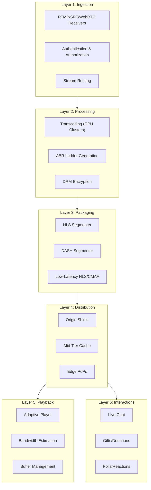

### Layer Responsibilities

| Layer | Primary Responsibility | Key Challenge |
|---|---|---|
| **Ingestion** | Receive raw stream from broadcaster | Handling unreliable uplinks; protocol negotiation |
| **Processing** | Transcode to multiple quality renditions | GPU compute cost; real-time constraint |
| **Packaging** | Segment into HLS/DASH chunks | Low-latency chunking; format compatibility |
| **Distribution** | Cache and deliver globally via CDN | Cache fill storms; geographic coverage |
| **Playback** | Adaptive quality client-side | Smooth ABR switching; rebuffer minimization |
| **Interactions** | Real-time chat, gifts, reactions | Fan-out at scale; message ordering |

---

## 3. Ingestion Pipeline

### 3.1 How the Streamer Connects

When a streamer goes live, their encoder (OBS, mobile app, hardware encoder) pushes a video stream to a **regional ingest server**.

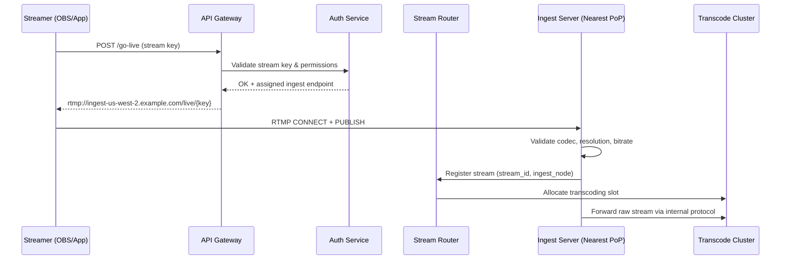

### 3.2 Ingest Protocols

| Protocol | Latency | Reliability | Use Case |
|---|---|---|---|
| **RTMP** | ~1-3s | Good (TCP) | Most common; OBS default |
| **SRT** | ~0.5-2s | Excellent (ARQ over UDP) | Professional/unstable networks |
| **WebRTC** | ~0.1-0.5s | Moderate | Browser-based streaming |
| **RTMPS** | ~1-3s | Good | RTMP over TLS (TikTok default) |

### 3.3 Ingest Server Design

Each ingest server is a **stateful** process that:

1. **Terminates the RTMP/SRT connection** from the streamer
2. **Validates** the stream: codec compatibility (H.264/H.265/AV1), keyframe interval, audio format
3. **Buffers** a small amount to smooth network jitter (100–500ms)
4. **Forwards** the raw stream to the transcoding cluster via an internal low-latency protocol (often SRT or raw RTP over private fiber)
5. **Monitors** stream health: dropped frames, bitrate stability, A/V sync

### 3.4 Redundancy at Ingest

> [!IMPORTANT]
> A single ingest server is a **single point of failure** for the entire stream. If it crashes, the stream dies.

Platforms solve this with:
- **Dual-publish**: The streamer's app sends to TWO ingest servers simultaneously (TikTok does this on mobile)
- **Hot-standby**: A secondary ingest server shadows the primary, ready to take over
- **Reconnect logic**: The client SDK auto-reconnects to a different ingest PoP within 1–2 seconds

---

## 4. Transcoding & Adaptive Bitrate

### 4.1 Why Transcode?

The streamer sends ONE quality level (e.g., 1080p @ 6 Mbps). But viewers have different:
- **Devices**: 4K TV vs. old phone
- **Bandwidth**: Fiber (50 Mbps) vs. 3G mobile (0.5 Mbps)
- **Data plans**: Unlimited vs. metered

The solution is **Adaptive Bitrate (ABR)** — generate multiple renditions and let the player switch dynamically.

### 4.2 ABR Ladder (Typical)

| Rendition | Resolution | Video Bitrate | Audio Bitrate | Target Audience |
|---|---|---|---|---|
| **Source/1080p60** | 1920×1080 | 6,000 kbps | 160 kbps | Fiber / Wi-Fi |
| **720p60** | 1280×720 | 3,000 kbps | 128 kbps | Good mobile / DSL |
| **480p30** | 854×480 | 1,500 kbps | 96 kbps | Average mobile |
| **360p30** | 640×360 | 800 kbps | 96 kbps | Slow mobile |
| **160p30** | 284×160 | 300 kbps | 64 kbps | Very slow / audio-only fallback |

### 4.3 Transcoding Architecture

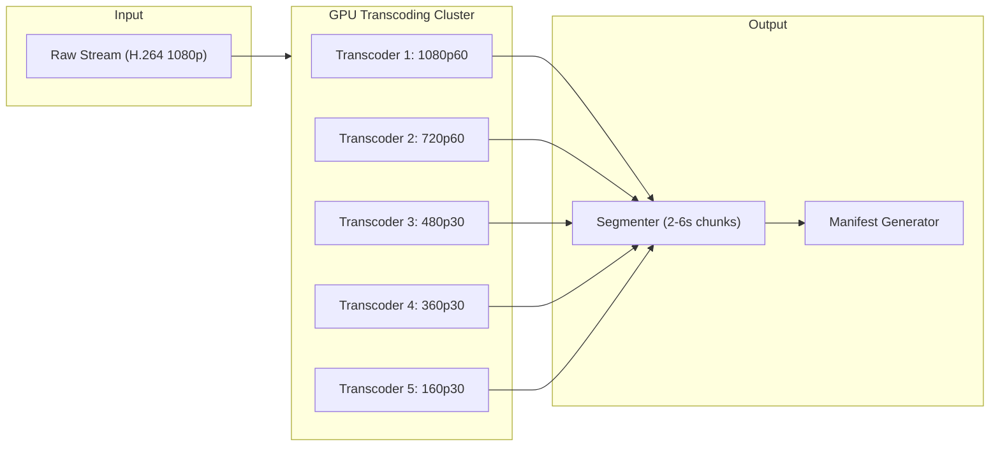

### 4.4 Transcoding Compute

| Aspect | Detail |
|---|---|
| **Hardware** | NVIDIA T4/A10G GPUs (NVENC), or custom ASICs (YouTube uses custom VCU chips) |
| **Software** | FFmpeg with NVENC, or proprietary (YouTube's Argos, TikTok's internal system) |
| **Cost per stream** | ~$0.02–0.10/minute for 5-rung ABR ladder |
| **Scaling unit** | 1 GPU can handle ~10–30 concurrent 1080p→ABR transcodes |
| **At scale** | 100K concurrent streams × 1 GPU/10 streams = **~10,000 GPUs** for transcoding alone |

### 4.5 Keyframe-Aligned Encoding

> [!TIP]
> All renditions must have **keyframes (IDR frames) at exactly the same timestamps** so the player can switch between quality levels seamlessly without visual glitches.

This is called **aligned GOPs (Group of Pictures)**. The segmenter then cuts chunks at these aligned keyframes.

---

## 5. Content Delivery Network (CDN)

### 5.1 The Core Problem CDN Solves

Without a CDN, if 10 million viewers request the same stream directly from the origin server:
- **10M TCP connections** to a single server cluster
- **10M × 3 Mbps = 30 Tbps** bandwidth from one location
- **Latency**: Viewers in Tokyo get 200ms+ RTT to a US origin

With a CDN:
- Viewers connect to the **nearest edge PoP** (usually <20ms away)
- Each edge PoP fetches the stream **once** from the origin and serves it to all local viewers
- **Fan-out ratio**: 1 origin connection → 10,000+ viewer connections at the edge

### 5.2 CDN Hierarchy

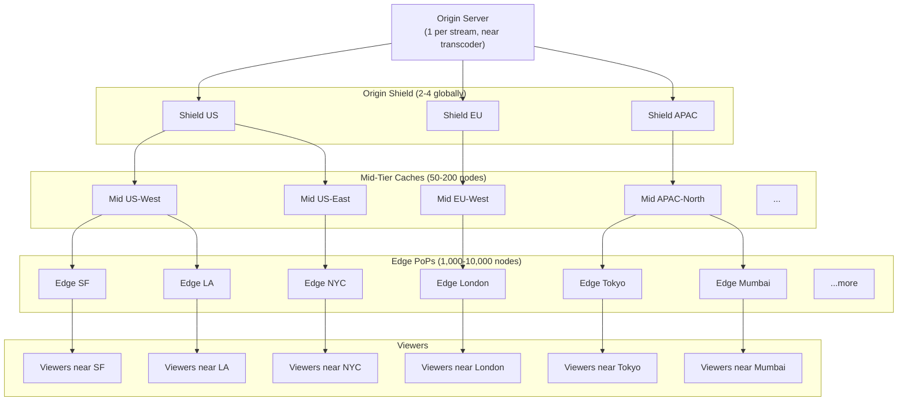

### 5.3 CDN Request Flow for a Live Stream Segment

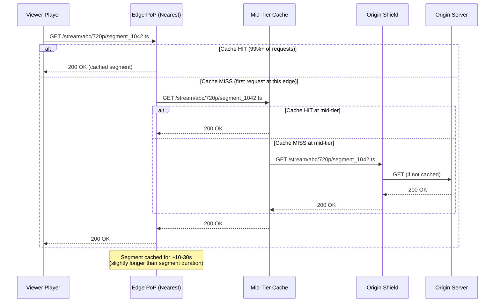

### 5.4 The "Thundering Herd" Problem

When a new segment is produced, **thousands of edge nodes** might simultaneously request it from the origin. This is called a **cache-fill storm** or **thundering herd**.

**Solutions:**
1. **Request coalescing**: If 1,000 viewers at the same edge request the same segment, the edge makes only ONE upstream request and serves the response to all 1,000
2. **Push-based CDN**: Instead of pull (edge requests from origin), the origin **pushes** new segments to all edge nodes proactively
3. **Consistent hashing**: Route requests for the same stream to the same mid-tier node, maximizing cache hit rates
4. **Staggered TTLs**: Slightly randomize cache expiry to prevent synchronized cache misses

### 5.5 CDN Providers Used at Scale

| Platform | CDN Strategy |
|---|---|
| **YouTube** | Google's private CDN (Google Global Cache — 10,000+ PoPs inside ISPs) |
| **TikTok** | ByteDance's CDN (BytePlus CDN) + Akamai, Cloudflare, Fastly |
| **Twitch** | Amazon CloudFront + own PoPs |
| **Netflix** | Open Connect (own appliances in 1,000+ ISPs) |

> [!NOTE]
> YouTube has a massive advantage here — Google's **Google Global Cache (GGC)** program places dedicated cache servers **inside ISP networks** worldwide. This means traffic never leaves the ISP's network, resulting in near-zero latency and near-zero transit costs.

---

## 6. Streaming Protocols

### 6.1 Protocol Comparison

| Protocol | How It Works | Latency | Browser Support | Use Case |
|---|---|---|---|---|
| **HLS** (HTTP Live Streaming) | Video split into .ts segments, playlist in .m3u8 | 6–30s | Universal | Default for most platforms |
| **LL-HLS** (Low-Latency HLS) | Partial segments + preload hints | 2–5s | Safari, growing | Apple ecosystem |
| **DASH** (Dynamic Adaptive Streaming over HTTP) | Similar to HLS but .mpd manifest + .m4s segments | 6–30s | Chrome, Firefox | YouTube's primary |
| **LL-DASH** (Low-Latency DASH) | Chunked transfer encoding for segments | 2–5s | Chrome | YouTube low-latency |
| **WebRTC** | Peer-to-peer or SFU-relayed RTP | 0.1–0.5s | Universal | Ultra-low latency (TikTok battles) |
| **CMAF** (Common Media Application Format) | Unified segment format for HLS + DASH | 2–5s | Universal | Simplifies packaging |

### 6.2 How HLS Works (Most Common)

```
Streamer → [Raw Video] → Transcoder → [Segmented Video Files]

master.m3u8 (Master Playlist)
├── 1080p.m3u8 → segment_001.ts, segment_002.ts, segment_003.ts, ...
├── 720p.m3u8  → segment_001.ts, segment_002.ts, segment_003.ts, ...
├── 480p.m3u8  → segment_001.ts, segment_002.ts, segment_003.ts, ...
└── 360p.m3u8  → segment_001.ts, segment_002.ts, segment_003.ts, ...
```

**Master Playlist Example (`master.m3u8`):**
```
#EXTM3U
#EXT-X-STREAM-INF:BANDWIDTH=6000000,RESOLUTION=1920x1080,FRAME-RATE=60
1080p.m3u8
#EXT-X-STREAM-INF:BANDWIDTH=3000000,RESOLUTION=1280x720,FRAME-RATE=60
720p.m3u8
#EXT-X-STREAM-INF:BANDWIDTH=1500000,RESOLUTION=854x480,FRAME-RATE=30
480p.m3u8
#EXT-X-STREAM-INF:BANDWIDTH=800000,RESOLUTION=640x360,FRAME-RATE=30
360p.m3u8
```

**Media Playlist Example (`720p.m3u8`):**
```
#EXTM3U
#EXT-X-TARGETDURATION:4
#EXT-X-MEDIA-SEQUENCE:1040

#EXTINF:4.000,
720p/segment_1040.ts
#EXTINF:4.000,
720p/segment_1041.ts
#EXTINF:4.000,
720p/segment_1042.ts
```

The player polls the media playlist every segment duration (~4s), discovers new segments, and downloads them.

### 6.3 Latency Breakdown

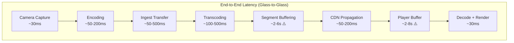

> [!WARNING]
> The biggest contributors to latency are **segment buffering** (waiting to fill a complete segment before it can be sent) and **player buffer** (the player maintains a buffer of 2–3 segments to handle network jitter). This is why standard HLS has 6–30s of latency.

**Low-latency techniques reduce this by:**
- Using **partial segments** (LL-HLS sends 200ms parts instead of waiting for a full 4s segment)
- Using **chunked transfer encoding** (streaming the segment as it's being created)
- Reducing **player buffer** to 1–2 segments with faster ABR algorithms

---

## 7. Real-Time Chat & Interactions

### 7.1 The Scale Challenge

A popular streamer with 500K concurrent viewers where 1% are actively chatting = **5,000 messages/second** that must be:
1. **Received** from senders
2. **Moderated** (spam, toxicity filtering)
3. **Fan-out** to 500,000 connected clients

This is a separate system from video delivery, typically using **WebSockets** or **Server-Sent Events (SSE)**.

### 7.2 Chat Architecture

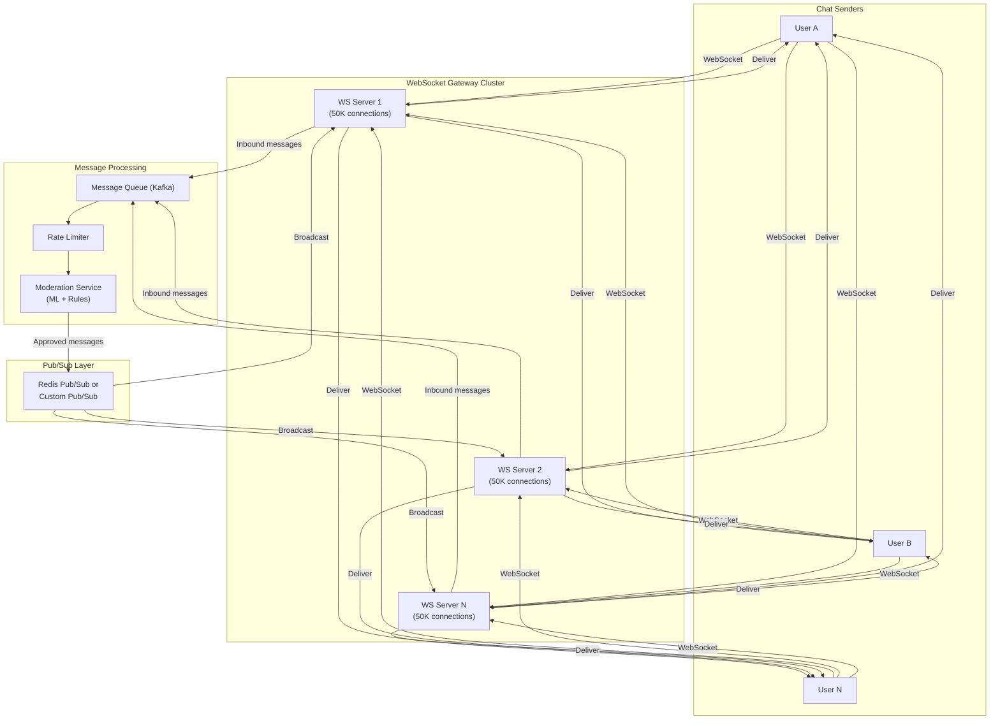

### 7.3 Fan-Out Strategies

| Strategy | Description | Pros | Cons |
|---|---|---|---|
| **Server-side fan-out** | Each WS server subscribes to a pub/sub channel for each room | Simple | High memory + bandwidth on pub/sub layer |
| **Client-side polling** | Clients poll an HTTP endpoint every 1–2s for new messages | Stateless servers | Higher latency; more HTTP overhead |
| **Tiered fan-out** | Group WS servers into tiers; pub/sub fans out to tier leaders, who fan out to members | Scales further | More complexity |
| **Message sampling** | At extreme scale (1M+ viewers), only show a random sample of chat messages | Reduces fan-out | Not all messages shown |

> [!TIP]
> YouTube and TikTok use **message sampling** for very large streams. When a stream has millions of viewers, showing every chat message would be unreadable anyway. Instead, they sample messages and display a curated feed, which also dramatically reduces fan-out costs.

### 7.4 Gifts & Donations (TikTok Specific)

TikTok's gift system requires **transactional guarantees** (money is involved), so it uses a separate path:

1. **Gift purchase** → Payment service (strongly consistent, ACID transactions)
2. **Gift animation** → Pushed via WebSocket to the streamer + all viewers
3. **Revenue split** → Async settlement via the payments platform

This is treated as a **financial transaction first, a visual event second**.

---

## 8. Scaling Strategies

### 8.1 Horizontal Scaling by Layer

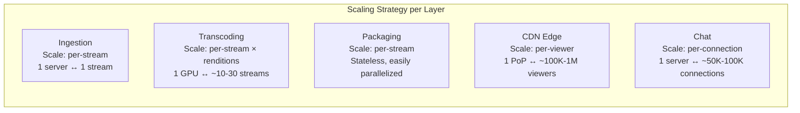

### 8.2 Key Scaling Patterns

#### Pattern 1: Shard by Stream ID
Every stream gets a unique ID. All infrastructure is **sharded by this ID**:
- Transcoding cluster for stream X is independent of stream Y
- CDN caching is keyed by stream ID + rendition + segment number
- Chat rooms are independent per stream

This means streams don't interfere with each other — a 10M-viewer stream doesn't impact a 10-viewer stream.

#### Pattern 2: Geographic Distribution
- **Ingest**: Streamer connects to nearest region (latency-sensitive for uplink)
- **Transcoding**: Done in the nearest cloud region to the ingest PoP
- **CDN**: Viewers served from nearest edge PoP (latency-sensitive for playback)
- **Chat**: WebSocket servers deployed in every region; pub/sub connects them

#### Pattern 3: Auto-Scaling Based on Viewer Count
| Viewer Count | Scaling Action |
|---|---|
| 0–100 | Single edge PoP, no mid-tier, minimal resources |
| 100–10K | Multiple edge PoPs activated, mid-tier cache warmed |
| 10K–100K | Full CDN hierarchy, dedicated chat cluster |
| 100K–1M | Multi-CDN (use Akamai + Cloudflare simultaneously), message sampling |
| 1M+ | ISP-level caching (GGC), P2P assist (optional), aggressive sampling |

#### Pattern 4: Peer-to-Peer Assist (P2P CDN)
Some platforms use **WebRTC-based P2P** to offload CDN bandwidth:
- Viewers who already have a segment share it with nearby viewers
- Reduces CDN egress by 30–60%
- TikTok has experimented with this for very popular streams

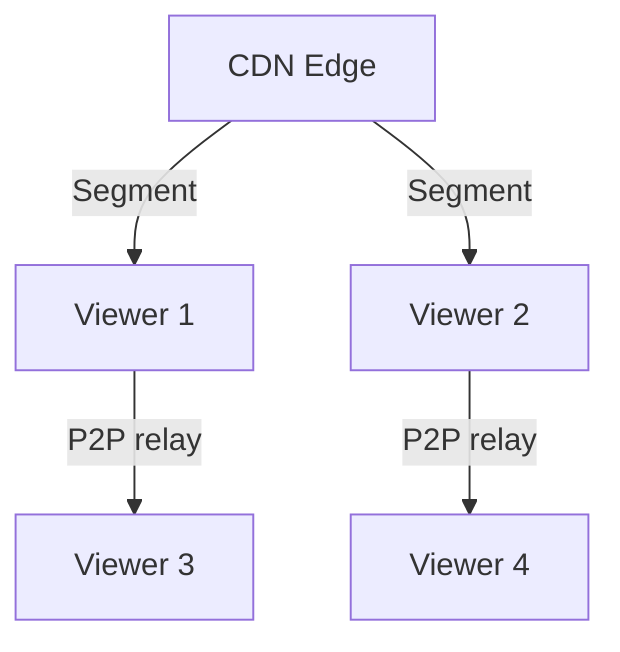

---

## 9. Fault Tolerance & High Availability

### 9.1 Failure Modes & Mitigations

| Failure | Impact | Mitigation |
|---|---|---|
| **Streamer network drop** | Stream goes offline | Auto-reconnect in client SDK; show "reconnecting" overlay |
| **Ingest server crash** | Stream dies for all viewers | Dual-publish; hot standby; auto-failover to backup ingest |
| **Transcoder failure** | One or more renditions stop | Health checks; auto-restart; spare GPU capacity |
| **Origin server failure** | All CDN edges lose source | Origin redundancy (active-passive); CDN serves stale segments (grace period) |
| **CDN edge PoP failure** | Viewers in that region affected | DNS/Anycast failover to next-nearest PoP (~10s) |
| **Chat server crash** | Viewers lose chat connection | WebSocket reconnect; server-side session state in Redis |
| **Entire region failure** | Major outage for a geography | Multi-region deployment; cross-region failover |

### 9.2 Graceful Degradation

When the system is under extreme load, it degrades gracefully:

1. **Drop lower renditions first** — Stop serving 160p/360p; most viewers are on higher quality anyway
2. **Increase segment duration** — Switch from 2s to 6s segments (increases latency but reduces origin load by 3×)
3. **Enable message sampling** — Reduce chat fan-out
4. **Redirect to secondary CDN** — Multi-CDN failover
5. **Throttle new viewers** — Queue new join requests; show "stream is full" for extreme cases

### 9.3 Multi-Region Deployment

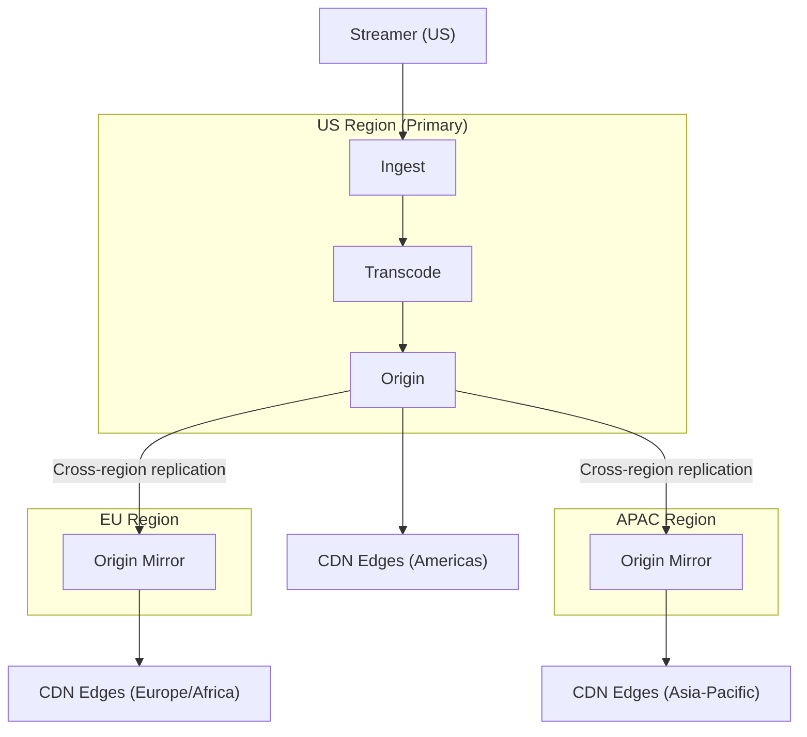

---

## 10. Monitoring & Observability

### 10.1 Key Metrics to Monitor

#### Streamer-Side Metrics
| Metric | Target | Alert Threshold |
|---|---|---|
| Uplink bitrate | Stable at configured rate | >20% deviation for >10s |
| Dropped frames | 0% | >1% |
| Keyframe interval | Every 2s | Missing keyframes |
| A/V sync drift | <50ms | >200ms |

#### Platform-Side Metrics
| Metric | Target | Alert Threshold |
|---|---|---|
| Transcoding latency | <500ms per segment | >1s |
| Segment publish rate | 1 segment per target duration | Missing segments |
| CDN cache hit ratio | >99% | <95% |
| Origin bandwidth | Proportional to PoP count | Unexpected spikes |

#### Viewer-Side Metrics (Client Telemetry)
| Metric | Target | Alert Threshold |
|---|---|---|
| Time to first frame | <2s | >5s |
| Rebuffer rate | <0.5% of viewing time | >2% |
| Rebuffer frequency | <1 per 10 min | >3 per 10 min |
| ABR quality distribution | >70% on 720p+ | >30% on 360p or below |
| Glass-to-glass latency | <5s | >15s |
| Playback failure rate | <0.1% | >1% |

### 10.2 Observability Stack

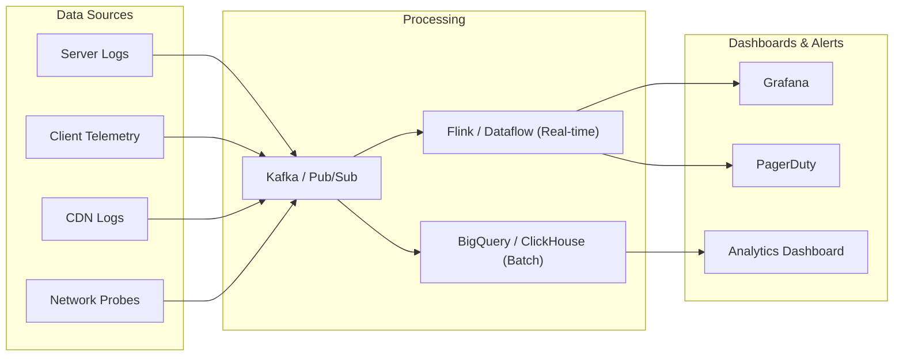

---

## 11. Cost Considerations

### 11.1 Cost Breakdown for a Large Platform

| Cost Category | % of Total | Key Driver |
|---|---|---|
| **CDN / Bandwidth** | 40–50% | Egress bandwidth is the #1 cost |
| **Transcoding (GPU compute)** | 20–30% | GPU hours for real-time encoding |
| **Storage** | 5–10% | VOD replays, segment storage |
| **Compute (non-GPU)** | 10–15% | Chat servers, API, routing, moderation |
| **Networking (inter-region)** | 5–10% | Cross-region replication |

### 11.2 Cost Optimization Strategies

| Strategy | Savings | How |
|---|---|---|
| **Own your CDN** | 50–70% on bandwidth | YouTube (GGC), Netflix (Open Connect) |
| **AV1/H.265 encoding** | 30–50% bandwidth savings | Better compression = less egress cost |
| **P2P assist** | 30–60% CDN offload | Viewers relay to each other |
| **Tiered transcoding** | 20–40% GPU savings | Only generate high renditions for popular streams |
| **Spot/preemptible GPUs** | 60–70% compute savings | Use spot instances for non-critical transcoding |
| **Per-title encoding** | 10–30% bandwidth | Optimize bitrate ladder per content type |

### 11.3 Example: Cost of Serving a 1M Viewer Stream for 1 Hour

| Item | Calculation | Cost |
|---|---|---|
| **Transcoding** | 1 stream × 5 renditions × 1 hour × $0.50/hr/GPU | ~$2.50 |
| **CDN Egress** | 1M viewers × 3 Mbps avg × 3600s = ~1.35 PB | ~$13,500 (at $0.01/GB) |
| **Chat infrastructure** | 1M WebSocket connections × 1 hour | ~$500 |
| **Total** | | **~$14,000/hour** |

> [!CAUTION]
> **CDN egress bandwidth dominates all costs.** This is why YouTube and Netflix invest billions in building their own CDN infrastructure — at their scale, it's far cheaper than paying a third-party CDN.

---

## 12. Technology Stack Summary

### 12.1 Recommended Technology Choices

| Component | Technology Options |
|---|---|
| **Ingest Server** | Custom C/C++ (nginx-rtmp-module, SRS, Janus for WebRTC) |
| **Transcoding** | FFmpeg + NVENC, or proprietary (YouTube Argos) |
| **Segmenter/Packager** | Shaka Packager, Unified Streaming |
| **Origin Server** | Nginx, custom Go/Rust HTTP server |
| **CDN** | Akamai, Cloudflare, Fastly, CloudFront, or custom (GGC/Open Connect) |
| **Chat/WebSocket** | Custom Go/Rust/Elixir servers; Redis Pub/Sub; Kafka |
| **Metadata Store** | Redis (hot), PostgreSQL/Spanner (cold) |
| **Service Mesh** | gRPC between internal services; Envoy/Istio |
| **Monitoring** | Prometheus + Grafana, Datadog, custom telemetry |
| **Message Queue** | Apache Kafka, Google Pub/Sub |
| **ML/Moderation** | TensorFlow/PyTorch for content moderation, toxicity detection |
| **Player SDK** | hls.js (web), ExoPlayer (Android), AVPlayer (iOS) |

### 12.2 Full System Architecture Summary

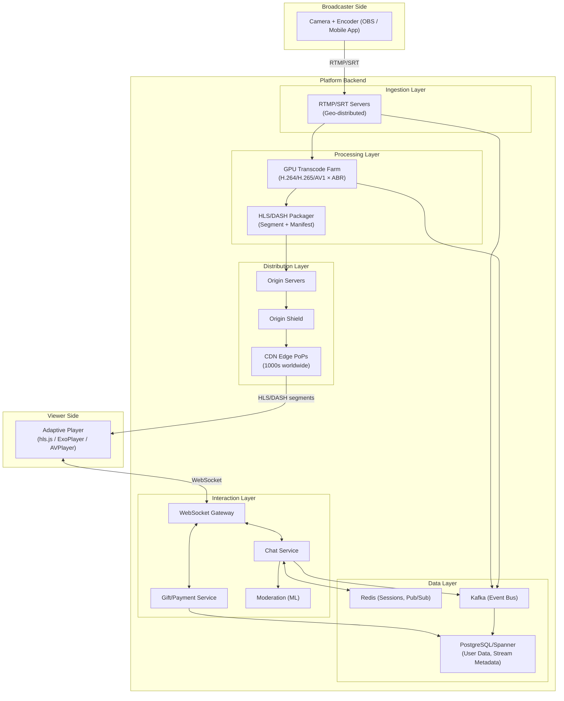

---

## Summary

The key principles that enable platforms like YouTube and TikTok to serve millions of concurrent live stream viewers are:

1. **Hierarchical distribution** — Never serve directly from origin; use a CDN tree to fan-out
2. **Adaptive bitrate** — Serve the right quality to each viewer based on their conditions
3. **HTTP-based delivery** — Use HLS/DASH over HTTP so standard CDN infrastructure works
4. **Shard by stream** — Each stream is independent; one hot stream doesn't affect others
5. **Stateless where possible** — Packaging, CDN edge, and API layers are stateless and horizontally scalable
6. **Graceful degradation** — When overloaded, reduce quality/features rather than failing entirely
7. **Own the CDN at scale** — At YouTube/Netflix scale, owning CDN hardware saves billions

> [!IMPORTANT]
> The most important takeaway: **live streaming at scale is fundamentally a caching and distribution problem, not a computation problem.** The hard part isn't encoding the video — it's getting it to millions of eyeballs with low latency and high reliability, everywhere in the world, simultaneously.
